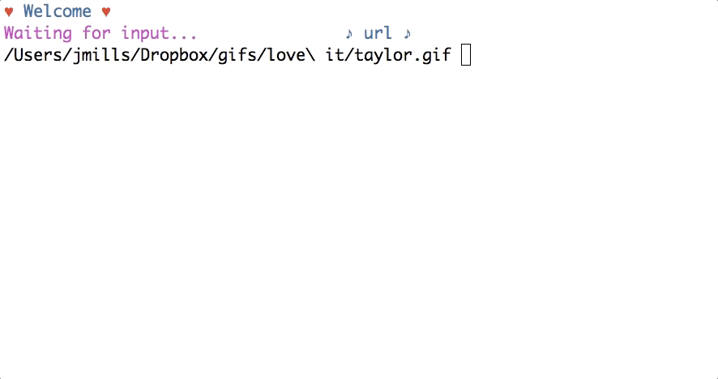

# Gifs

[](https://circleci.com/gh/trueheart78/gifs)

Gif management using Dropbox public links and Sqlite in a gem package. :heart:

Currently requires access to Dropbox via the `~/Dropbox` path. Expects a `~/Dropbox/gifs` directory storing gifs. This is also where the database file will be created, to track public Dropbox links for each gif.

## Installation

Add this line to your application's Gemfile:

```ruby
gem 'gifs'
```

And then execute:

    $ bundle

Or install it yourself as:

    $ gem install gifs

## Dropbox Integration

First, you need to create a new [Dropbox app][dropbox-new-app], using the **Dropbox API** (not the business option), with **Full Dropbox** access. Once you have that setup, you will need to click the _Generate_ button beneath the **Generate Access Token** header of the **OAuth2** section. This is the token that will be used for interacting with your Dropbox account.

### Configuration File

The configuration file needs to be created at `~/.gifs_config`, in YAML format.

Sample config file:

```yaml
DROPBOX_PATH: ~/Dropbox
DROPBOX_TOKEN: dropbox-generated-access-token
```

## Usage

There are currently two executables that can be called.

### `gif-listener`

Listens for gif paths to be entered and checks with the local database before reaching out to create a new shareable link via the Dropbox API.

Data displayed includes the name of the id gif, its directories, basename, size, number of times used, and the data copied to the clipboard




### `gif-count`

Without any arguments, it outputs the total number of gifs found.

```
1,358 gifs in 360 directories
```

With an argument, it will list the number of gifs found in matching directories.

```
$ gif-count angry
13 gifs in 1 directories

$ tree ~/Dropbox/gifs/angry
/home/josh/Dropbox/gifs/angry
├── banner.gif
├── bender.gif
├── brushstration.gif
├── carey.gif
├── conan.gif
├── dipper - snack -gravity falls.gif
├── farva - super troopers.gif
├── frick.gif
├── fry.gif
├── grunkle stand - hand gesture - gravity falls.gif
├── hermes.gif
├── snoopy.gif
└── spock.gif
```

It also checks sub-directories when passed an argument.

```
$ gif-count taylor\ swift
5 gifs in 2 directories

$ tree ~/Dropbox/gifs/taylor\ swift
/home/josh/Dropbox/gifs/taylor swift
└── lwymmd
    ├── taylor bat focused.gif
    ├── taylor bat mask removal.gif
    ├── taylor bat money swing.gif
    ├── taylor bat pointing.gif
    └── taylor swift motorcycle gear.gif
```

## Database Storage

The SQLite database file can be found in the `Dropbox/gifs/.gifs` directory, as `gifs.sqlite.db`.

## Development

After checking out the repo, run `bin/setup` to install dependencies. Then, run `rake spec` to run the tests. You can also run `bin/console` for an interactive prompt that will allow you to experiment.

To install this gem onto your local machine, run `bundle exec rake install`. To release a new version, update the version number in `version.rb`, and then run `bundle exec rake release`, which will create a git tag for the version, push git commits and tags, and push the `.gem` file to [rubygems.org](https://rubygems.org).

## Contributing

Bug reports and pull requests are welcome on GitHub at https://github.com/[USERNAME]/gifs. This project is intended to be a safe, welcoming space for collaboration, and contributors are expected to adhere to the [Contributor Covenant](http://contributor-covenant.org) code of conduct.

## License

The gem is available as open source under the terms of the [MIT License](http://opensource.org/licenses/MIT).

## Code of Conduct

Everyone interacting in the Gifs project’s codebases, issue trackers, chat rooms and mailing lists is expected to follow the [code of conduct](https://github.com/[USERNAME]/gifs/blob/master/CODE_OF_CONDUCT.md).

[dropbox-new-app]: https://www.dropbox.com/developers/apps
